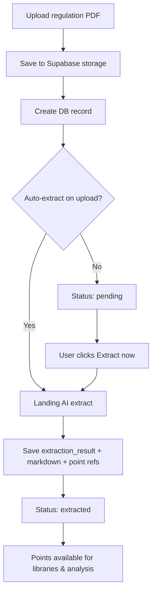
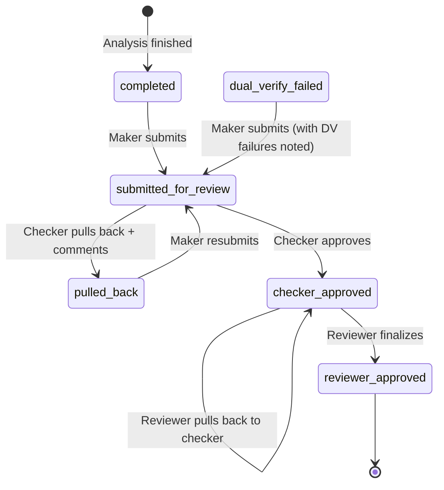

# BCP New Dashboard — End-to-End Workflow Specification

**Document type:** Product & process workflow (no code changes)  
**Audience:** Product owner, PM, developers, QA  
**Scope:** New Dashboard (`/nd/*`) — legacy dashboard remains at `/old/*`  
**Last updated:** 2026-08-21  
**Diagrams:** [SYSTEM-WORKFLOW-DIAGRAMS.md](./workflow/SYSTEM-WORKFLOW-DIAGRAMS.md)

---

## 1. Platform principle

| Rule | Detail |
|------|--------|
| **Dual dashboard** | `/nd/*` = new enterprise workflow. `/old/*` = existing implementation unchanged. |
| **No breaking changes** | All new behaviour is built in ND pages, APIs under `/nd/`, and shared components. Legacy routes and flows stay as-is. |
| **Reuse AI pipeline** | Landing AI (Phase 1) + Google Gemini (Phase 2 / dual verify) — same services as legacy, with Supabase caching to save credits. |
| **Single source of truth** | PostgreSQL (Supabase) for runs, points, action-plan history, review workflow, document extraction refs. |

---

## 2. Roles & authentication

### 2.1 Roles

| Role | Primary responsibility |
|------|------------------------|
| **Super Admin** | Platform setup: users, departments, deleted-run recovery, system config |
| **Maker** | Upload docs, build libraries, run analysis, edit action plans, submit for review |
| **Checker** | Review submitted runs (like a PR reviewer), comment point-wise / plan-wise, approve or pull back to maker |
| **Reviewer** | Final sign-off after checker approval; can pull back to checker or finalize |

### 2.2 Auth flow (target)

```
Register/Invite → Email verification → Login → Role-based ND shell
Super Admin → Forgot password (email/Gmail) → Reset → Login
Super Admin → Create users (role: maker | checker | reviewer)
```

**Current state:** Supabase JWT auth exists under `/nd/auth/*`. Super-admin user management at `/nd/admin/users`. Forgot/reset password pages exist. Verify email delivery in your environment before go-live.

---

## 3. Document management workflow

### 3.1 Document types

| Type | Source | Storage | Extraction |
|------|--------|---------|------------|
| **Regulation docs** | PDF upload | Supabase bucket + `regulation_documents` / `stored_documents` | Landing AI → points + markdown saved to DB |
| **Internal docs** | PDF upload | Supabase bucket + `internal_documents` | Used at analysis time (compare against regulation points) |
| **Libraries** | Curated from extracted points | `libraries` + `library_points` (snapshots from DB) | **No AI cost** — points loaded from prior extractions |

### 3.2 Regulation document lifecycle



**UI requirements (regulation documents page `/nd/regulation-documents`):**

- Show per-file status: `pending` | `extracting` | `extracted` | `failed` | `manual`
- If not extracted → **Extract now** button
- Link extraction result to document ID (reuse on re-open — no re-spend credits)
- Assign document to **department(s)** (many-to-many)
- Soft-hide document (`status = -1`) — not hard delete

### 3.3 Internal document lifecycle

```
Upload → Store in container → Select at analysis run → Used in Landing AI compare (Phase 1)
```

### 3.4 Library builder workflow (`/nd/libraries/new`, `/nd/libraries/:id`)

**Goal:** Build `reg-library-1` from points across multiple regulation docs without calling AI.

**UI layout (3 columns):**

| Column 1 | Column 2 | Column 3 |
|----------|----------|----------|
| Regulation docs list | Points for selected doc | Selected library points (with source ref: doc + point id) |

**Actions:** Select points, name library, save, edit, delete library, view read-only panel.

**Each library point stores:** `sourceDocumentId`, `sourcePointId`, snapshot text/metadata — so analysis knows exactly which regulation requirement is being checked.

---

## 4. Analysis execution workflow

### 4.1 Create & run (Maker)

```mermaid
flowchart LR
  A[New analysis /nd/analyse-v8] --> B[Select internal doc]
  B --> C[Select regulation source]
  C --> D{Docs or Library?}
  D -->|Docs| E[Pick regulation doc(s) + points]
  D -->|Library| F[Pick library/libraries + points]
  E --> G[Create analysis run draft in DB]
  F --> G
  G --> H[Start run]
  H --> I[For each point: Phase 1 Landing AI]
  I --> J[Phase 2 Google dual verify]
  J --> K[Save per-point result + original AI action plan]
  K --> L{All points done?}
  L -->|No| I
  L -->|Yes| M[Finalize run status]
```

### 4.2 Per-point AI pipeline (unchanged logic, cleaner UX)

| Phase | Engine | Input | Output stored |
|-------|--------|-------|---------------|
| **Phase 1** | Landing AI | Regulation point + internal doc PDF/markdown | Compliance status, policy extract, message, action plan draft |
| **Phase 2** | Google Gemini | Phase 1 output + regulation point | Dual-verify status, agreement JSON, refined message |

**Landing AI is the base.** If Phase 1 fails → point shows failed; user can **Rerun this point** (full pipeline) or **Rerun dual verify only** if Phase 1 succeeded but Phase 2 failed.

### 4.3 Progress display

- Run header: **`32/34`** = processed / total points
- Per point: chips for Phase 1 / Phase 2 status
- Run-level banner if dual verify failed: **"Dual verify failed"** with **Rerun all failed dual verify** (skip Landing AI)

### 4.4 Run statuses (analysis phase)

| Status | Meaning | Row click opens |
|--------|---------|-----------------|
| `draft` | Created, not started | `/nd/analyse-v8?run={id}` — docs/points pre-filled |
| `running` | Processor active | Same — live progress 32/34 |
| `failed` | Run-level failure | Same — resume / rerun failed points |
| `landing_ai_complete` | All Phase 1 done, DV may be partial | Gap view if all processed; else analyse-v8 |
| `dual_verify_failed` | All points processed, some DV failed | `/nd/gap-analysis?run={id}` with DV-failed banner |
| `completed` | All points passed | `/nd/gap-analysis?run={id}` |

**Task 1 (your requirement):** Click row for `draft | running | failed | points pending` → open **`/nd/analyse-v8?run={id}`** with:

- Internal doc selected
- Regulation docs / libraries selected
- Points checked exactly as at run creation
- Progress `32/34`, failed points with rerun buttons
- Same UX as a live new run, but **resume** mode

---

## 5. Results & gap analysis workflow

### 5.1 When row opens gap analysis (Task 2)

**Statuses:** `completed`, `dual_verify_failed`, `submit for review pending` (`landing_ai_complete`, `pulled_back`)

**Route:** `/nd/gap-analysis?run={id}`  
**Equivalent legacy reference:** `/old/gap-analysis?saved=compliance:{uuid}`

### 5.2 Point detail panel (per selected point)

Must match the richness of legacy dual-verify PDF (reference: old dual-verify screen), structured as:

| Section | Editable? | Notes |
|---------|-----------|-------|
| Regulation point (gov text) | No | Title + full requirement |
| Policy extract | No | Citation, page, quote from internal doc |
| Phase 1 — Landing AI full detail | No | Collapsible full message |
| Phase 2 — Google AI full detail | No | Collapsible full message |
| Agreement / confidence / status | No | compliant \| partial compliant \| non compliant |
| **What this reference fulfills** | No | Bullet list from AI |
| **Corrective Action Plan** | **Yes — item-wise** | Each CAP line item editable separately |

### 5.3 Action plan edit & history (Task 2 detail)

**Rules:**

1. **Original AI output is immutable** — stored as `originalAiActionPlan` on first completion.
2. **Current plan** = `finalActionPlan` (what reports/export use).
3. Each edit creates **`action_plan_history`** row: who, when, previous value, new value, change type.
4. UI: small **View change history** label → **right-side panel popup** listing:
   - Original (AI — Landing or Google)
   - Changed 7 Jul 2026 12:58 AM by {maker name}
   - …
5. Each history entry: **Use this output** → sets that version as current `finalActionPlan` (new history row: `maker_reverted_to_version`).
6. History is **per action-plan item** when plan has multiple bullet points.

**Who can edit:** Maker (and super_admin) when run is NOT locked in checker/reviewer review (or when `pulled_back`).

### 5.4 Gap analysis page views (Task 3)

**Route:** `/nd/gap-analysis?run={id}`

**Filters:** Severity (compliant / partial compliant / non compliant), status, confidence, search text.

**Two view modes:**

| Mode | Layout |
|------|--------|
| **All cards** | Grid of point cards (summary) |
| **List view** | Left: scrollable point list. Right: full point detail (§5.2) |

**List view columns (summary row):** Point | AI extract | Fulfills | Action plan | Confidence | Status

**Export:** Excel + PDF (reuse existing export libs) — includes current (final) action plans, a leading **Name of Regulatory Document** column, clause heading **Clause from the regulatory document**, and an Action Plans sheet with reviews.

### 5.5 Analyse-v8 embedded results (Task 3)

Below the 3-column analysis layout on `/nd/analyse-v8`, when run has results:

- Toggle: **All cards** | **List view** (same components as gap analysis)
- **Submit for review** button when run is complete enough

### 5.6 Gap evidence upload and re-check

After analysis, a user can attach a new policy / gap document and re-judge:

| Scope | Where | What happens |
|-------|--------|----------------|
| One gap | Point detail — upload + **Rerun this gap** | Re-judges that clause against the uploaded file. Demo upgrades `non_compliant` → `partial_compliant` → `compliant` and cites the file; real users call AI. |
| Whole report | Overall analysis report panel — upload + **Rerun all gaps** | Same, for every open gap on the run. |

Updated fields after a successful rerun: policy extract, document reference, compliance status.

---

## 6. Review workflow (Maker → Checker → Reviewer)



### 6.1 Maker submit

- From gap analysis or analyse-v8
- Run must have all points processed (DV failures allowed but flagged)
- Status → `submitted_for_review`

### 6.2 Checker (`/nd/checker`, `/nd/checker/review/:runId`)

| Action | Effect |
|--------|--------|
| **Approve** | Status → `checker_approved` → appears in reviewer queue |
| **Pull back** | Requires comment → status → `pulled_back` → maker can edit CAPs |
| **Comments** | Per regulation point, per action plan (whole), per action plan item |

### 6.3 Reviewer (`/nd/reviewer`, `/nd/reviewer/review/:runId`)

| Action | Effect |
|--------|--------|
| **Finalize** | Status → `reviewer_approved` (terminal) |
| **Pull back to checker** | Status → `checker_approved` or `submitted_for_review` with history |

### 6.4 Audit trail

Every status change → `analysis_status_history`.  
Every review action → `analysis_reviews` + optional `analysis_point_comments`.

**UI:** Status phases visible on analysis-runs list and run detail header.

---

## 7. Analysis runs list (`/nd/analysis-runs`)

### 7.1 Row click routing (summary)

| Run condition | Destination |
|---------------|-------------|
| Draft / running / failed / `processed < total` | `/nd/analyse-v8?run={id}` |
| Completed / DV failed / submit pending / in review | `/nd/gap-analysis?run={id}` (or checker/reviewer review for those roles) |
| Legacy runs | Mapped via `legacyHref` / `legacySessionId` |

### 7.2 Soft delete (Task — delete option)

| Action | Behaviour |
|--------|-----------|
| **Delete** (maker on own run, super_admin on any) | `status = deleted` — hidden from all users |
| **Restore** | Super admin only — `/nd/admin/deleted-runs` |
| **Not hard delete** | All data retained for audit |

---

## 8. Department model

```
Departments (admin CRUD) ←→ Regulation documents (many-to-many)
User profiles ← department assignment (optional scoping)
```

**Use case:** Filter regulation library by department; restrict which docs a business unit can reference.

---

## 9. Page map (target ND)

| Page | Route | Role |
|------|-------|------|
| Login / Register / Forgot password | `/nd/auth/*` | Public |
| Overview | `/nd/overview` | All |
| Regulation documents | `/nd/regulation-documents` | All |
| Internal documents | `/nd/internal-documents` | All |
| Libraries | `/nd/libraries` | All (edit: maker+) |
| New analysis | `/nd/analyse-v8` | Maker+ |
| Analysis runs | `/nd/analysis-runs` | All |
| Gap analysis / results | `/nd/gap-analysis?run=` | All |
| Checker queue | `/nd/checker` | Checker+ |
| Reviewer queue | `/nd/reviewer` | Reviewer+ |
| Admin users | `/nd/admin/users` | Super admin |
| Admin departments | `/nd/admin/departments` | Super admin |
| Deleted runs | `/nd/admin/deleted-runs` | Super admin |
| **Legacy (unchanged)** | `/old/*` | Existing auth |

---

## 10. Data entities (reference)

| Entity | Purpose |
|--------|---------|
| `nd_analysis_runs` | Run metadata, status, doc/library refs, progress counts |
| `nd_analysis_points` | Per-point Phase 1/2 results, final status, CAPs |
| `nd_action_plan_history` | Versioned CAP edits |
| `nd_analysis_reviews` | Checker/reviewer decisions |
| `nd_analysis_point_comments` | Point/plan comments |
| `nd_analysis_status_history` | Run status audit |
| `regulation_documents` | Upload + extraction status + result JSON |
| `internal_documents` | Internal policy PDFs |
| `libraries` / `library_points` | Curated point sets |
| `departments` | Org structure |
| `landing_ai_parse_cache` / `landing_ai_extract_cache` | Credit-saving AI caches |
| `hidden_legacy_runs` | Soft-hide legacy sessions from ND list |

---

## 11. Cursor discovery prompts (use before implementing)

Copy these prompts into Cursor to map existing code without changing it.

### Prompt A — Analysis runs row click & resume

```
In bcp-web and bcp-api, trace how /nd/analysis-runs row clicks route to
/nd/analyse-v8 or /nd/gap-analysis. Document:
- run-links.ts logic (analysisRunNeedsExecutionView, ndAnalysisRunQuery)
- analyse-v8 attachToNdAnalysisRun() and ?run= query handling
- What is pre-filled vs missing when resuming draft/failed runs
- API: GET /nd/analysis-runs/{id}, POST .../start, .../rerun-point, .../rerun-dual-verify
Do not modify files. List gaps vs "resume with docs/points selected and 32/34 progress".
```

### Prompt B — Dual verify & extraction pipeline

```
Trace the full Landing AI + Google Gemini pipeline from API to UI:
- DualVerifyJobProcessor.cs vs NdAnalysisProcessor.cs
- LandingAiCompareService, GeminiService, cache tables
- How analyse-base.ts runAnalysis() differs from ND createAnalysisRun + startAnalysisRun
- Where compliance sessions (saved=compliance:uuid) are written and read
Do not modify. Summarize which path analyse-v8 "Run" button uses today.
```

### Prompt C — Gap analysis & point detail UI

```
Compare legacy gap-analysis and ND gap-analysis:
- nd-gap-analysis.component.ts vs gap-analysis-report.component.ts
- nd-gap-point-detail.component (sections: regulation, policy, phase1, phase2, CAP, fulfills)
- Action plan edit API: PUT /nd/results/{runId}/action-plan/{pointId}
- History panel and revertToVersion flow
Do not modify. List UI gaps vs dual-verify PDF reference layout.
```

### Prompt D — Auth, roles, checker/reviewer

```
Document ND auth and workflow:
- nd-auth.service.ts, guards, Supabase JWT validation in API
- CheckerController and ReviewerController endpoints
- nd-checker-review and nd-reviewer-review components
- Status transitions in AnalysisRunsController
Do not modify. Note what is hardcoded vs production-ready.
```

### Prompt E — Documents, libraries, departments

```
Document regulation doc upload/extract and library builder:
- RegulationDocumentsController, NdRegulationUploadService
- nd-regulation-documents UI extraction status
- nd-library-builder 3-column picker
- DepartmentsController and doc-department linking
Do not modify. List missing: extract polling, department filters, library soft-delete.
```

---

## 12. Implementation phases (recommended)

| Phase | Focus | Depends on |
|-------|-------|------------|
| **P0** | Unify analyse-v8 "Run" with ND `createAnalysisRun` + `startAnalysisRun` | Prompt B |
| **P1** | Perfect resume: row click → analyse-v8 with full state | Prompt A |
| **P2** | Gap analysis point detail + item-wise CAP history panel | Prompt C |
| **P3** | List view + filters on gap analysis & analyse-v8 results | Task 3 |
| **P4** | Submit → checker → reviewer polish + comment granularity | Prompt D |
| **P5** | Regulation extract status UX + department tagging | Prompt E |
| **P6** | Soft delete admin page QA + export parity | Existing admin pages |

---

## 13. Acceptance criteria checklist

- [ ] Maker can upload reg + internal docs; reg docs show extract status + Extract now
- [ ] Libraries built from DB points (no AI) with doc+point references
- [ ] New analysis creates DB run; progress shows N/M; failed points rerunnable
- [ ] Row click on in-progress run opens analyse-v8 with exact prior selections
- [ ] Row click on completed run opens gap analysis with full point detail
- [ ] CAP editable item-wise; original AI preserved; history panel with revert
- [ ] Dual verify failed runs show banner + rerun DV only
- [ ] Gap analysis: filters + cards + list view (left list, right detail)
- [ ] Submit for review → checker approve/pull back → reviewer finalize
- [ ] Delete hides run; super admin restores from deleted-runs page
- [ ] Excel/PDF export uses final action plans
- [ ] `/old/*` unchanged and reachable at localhost:3002/old

---

*This document defines **what** the workflow should be. See `ND_SYSTEM_FULFILLMENT.md` for what is already built vs gaps.*
