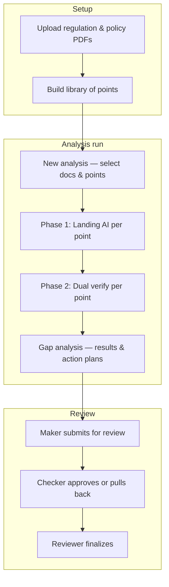

# Reguliq — Simple Analysis Workflow

A short overview of how an analysis run moves from setup → AI → review → sign-off.

**Dashboard:** New workflow lives at `/nd/*` (legacy stays at `/old/*`).

---

## 1. Big picture (4 phases)

```
┌─────────────┐     ┌─────────────┐     ┌─────────────┐     ┌─────────────┐
│   SETUP     │ ──► │   ANALYSE   │ ──► │   REVIEW    │ ──► │   SIGN-OFF  │
│             │     │             │     │             │     │             │
│ Upload docs │     │ Run AI on   │     │ Checker +   │     │ Reviewer    │
│ Build       │     │ each point  │     │ Maker edits │     │ finalizes   │
│ libraries   │     │             │     │             │     │             │
└─────────────┘     └─────────────┘     └─────────────┘     └─────────────┘
     Maker               Maker            Maker / Checker         Reviewer
```

---

## 2. Setup (before any run)

```
  Regulation PDF          Internal policy PDF
        │                         │
        ▼                         ▼
  ┌───────────┐             ┌───────────┐
  │ Extract   │             │  Upload   │
  │ points    │             │  (store)  │
  └─────┬─────┘             └─────┬─────┘
        │                         │
        └──────────┬──────────────┘
                   ▼
            ┌─────────────┐
            │   Library   │  ← pick regulation points to check
            │  (optional) │
            └─────────────┘
```

**Who:** Maker  
**Where:** Regulation docs · Internal docs · Libraries

---

## 3. How one analysis run works

### 3.1 Maker starts a run

```
┌──────────────────────────────────────────────────────────┐
│  Analyse (New analysis)                                   │
│  • Pick internal document                                 │
│  • Pick regulation doc(s) or library + points             │
│  • Click Run (type "start" to confirm on ND)              │
└────────────────────────────┬─────────────────────────────┘
                             ▼
                    ┌────────────────┐
                    │  Analysis run  │  saved in database
                    │  status: draft │  (draft → running → …)
                    └────────┬───────┘
                             ▼
              For EACH regulation point selected:
```

### 3.2 AI checks each point (same for every point)

```
        Regulation point + Internal document
                      │
                      ▼
              ┌───────────────┐
              │   PHASE 1     │  Landing AI
              │   Compare     │  → status, policy quote, draft action plan
              └───────┬───────┘
                      ▼
              ┌───────────────┐
              │   PHASE 2     │  Google Gemini (dual verify)
              │   Verify      │  → agree / mismatch / confidence gap
              └───────┬───────┘
                      ▼
              ┌───────────────┐
              │ Save result   │  per point in the run
              │ + action plan │
              └───────────────┘
```

### 3.3 When the run finishes

```
        All points processed?
                 │
        ┌────────┴────────┐
        ▼                 ▼
   ┌─────────┐      ┌──────────────┐
   │ Done    │      │ Some dual-   │
   │         │      │ verify failed│
   └────┬────┘      └──────┬───────┘
        │                  │
        └────────┬─────────┘
                 ▼
        ┌─────────────────┐
        │  Gap analysis   │  view all points, edit action plans
        │  /nd/gap-analysis
        └─────────────────┘
```

**Progress:** Header shows e.g. **32 / 34** points done.

---

## 4. Review workflow (after analysis)

```
                    ┌─────────────────────┐
                    │  Gap analysis done  │
                    │  Maker edits CAPs   │
                    └──────────┬──────────┘
                               │
                               ▼
                    ┌─────────────────────┐
                    │ Submit for review   │
                    └──────────┬──────────┘
                               ▼
┌──────────────────────────────────────────────────────────────┐
│                        CHECKER                                │
│  • Open each point + corrective actions                       │
│  • Set per-action: Approve | Need modify | UIX (+ comment)    │
│  • Approve  ──────────────────────────►  goes to Reviewer    │
│  • Pull back ──────────────────────────►  back to Maker       │
└──────────────────────────────────────────────────────────────┘
                               │
                               ▼ (if checker approved)
┌──────────────────────────────────────────────────────────────┐
│                        REVIEWER                               │
│  • Final read of run                                          │
│  • Finalize  ──────────────────────────►  Complete          │
│  • Pull back ──────────────────────────►  back to Checker     │
└──────────────────────────────────────────────────────────────┘
```

---

## 5. Run status (simple labels)

| Status | What it means | Where to open |
|--------|----------------|---------------|
| **Draft / Running** | Still analysing or not started | Analyse page (`?run=…`) |
| **Completed** | All points done | Gap analysis |
| **Submitted for review** | Waiting for checker | Checker queue |
| **Pulled back** | Checker sent back to maker | Gap analysis (edit & resubmit) |
| **Checker approved** | Waiting for reviewer | Reviewer queue |
| **Review complete** | Signed off | Analysis runs list |

---

## 6. Who does what (one box per role)

```
┌──────────────┐   ┌──────────────┐   ┌──────────────┐   ┌──────────────┐
│    MAKER     │   │   CHECKER    │   │   REVIEWER   │   │ SUPER ADMIN  │
├──────────────┤   ├──────────────┤   ├──────────────┤   ├──────────────┤
│ Upload docs  │   │ Review queue │   │ Final queue  │   │ Users        │
│ Run analysis │   │ Approve or   │   │ Finalize or  │   │ Departments  │
│ Edit action  │   │ pull back    │   │ pull back    │   │ Restore runs │
│ plans        │   │ Comment on   │   │              │   │              │
│ Submit       │   │ actions      │   │              │   │              │
└──────────────┘   └──────────────┘   └──────────────┘   └──────────────┘
```

---

## 7. One-page flow (for slides)



---

## 8. Key pages (cheat sheet)

| Step | Page |
|------|------|
| Start run | `/nd/analyse-v8` |
| All runs | `/nd/analysis-runs` |
| Results & edit plans | `/nd/gap-analysis?run={id}` |
| Checker | `/nd/checker` |
| Reviewer | `/nd/reviewer` |

---

*For full product detail see [ND_WORKFLOW.md](./ND_WORKFLOW.md).*
