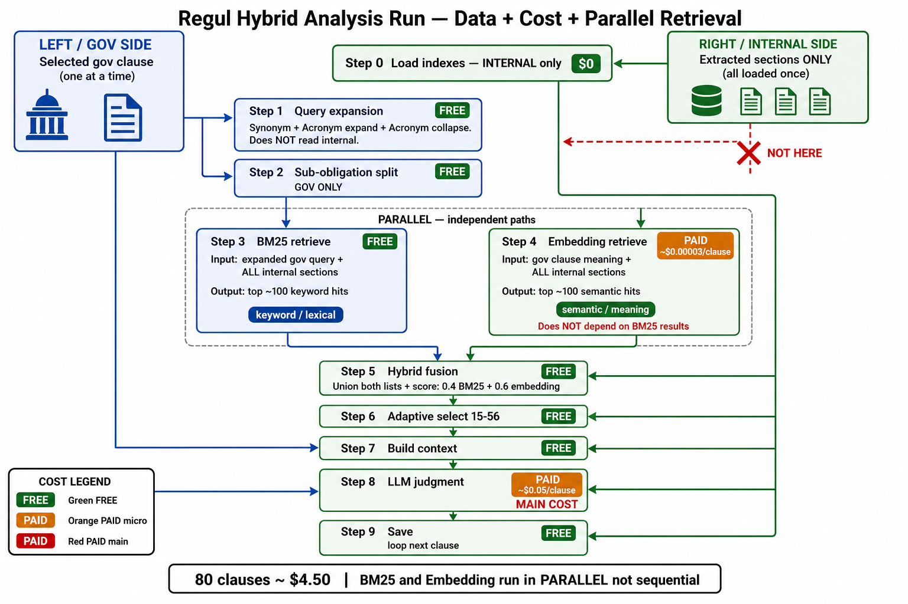
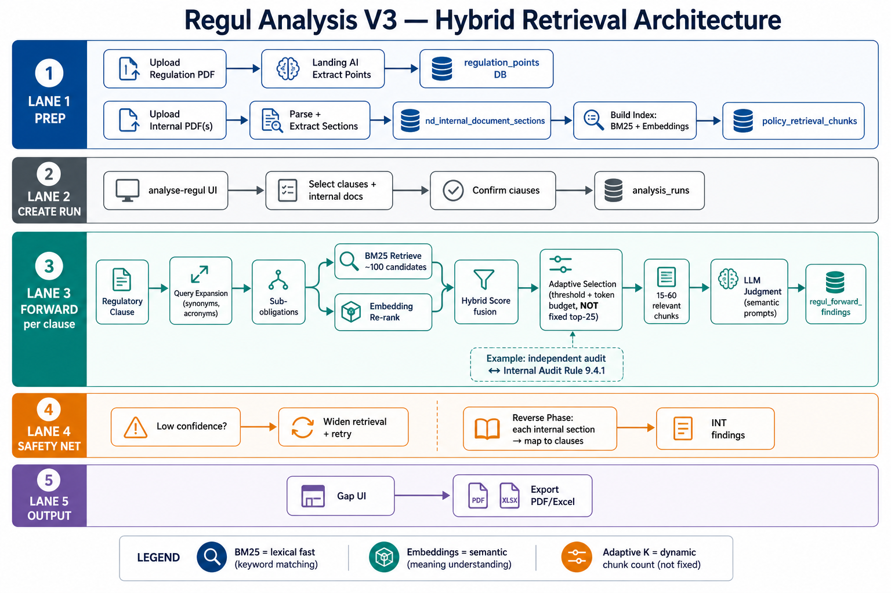
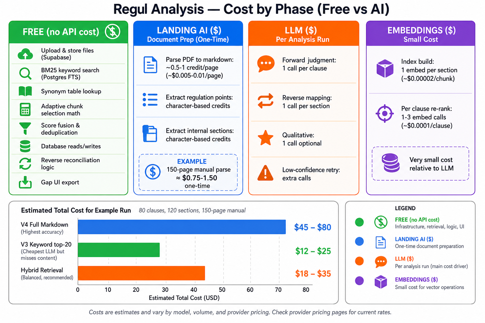

# Regul Hybrid Retrieval Workflow

**Proposed design** for forward-only compliance analysis using **section extract** + **BM25** + **semantic embeddings** + **LLM judgment**.

| | |
|--|--|
| **Scope** | Forward only — no reverse, no qualitative |
| **Chunk source** | Landing AI **section extract** (1 chunk = 1 policy rule) |
| **Compare to shipped** | [`workflow-v3.md`](workflow-v3.md) (keyword top-20) · [`workflow-v4.md`](workflow-v4.md) (full markdown) |

---

## Diagrams

| Diagram | File | What it shows |
|---------|------|---------------|
| **Problem + guide (start here)** | [`REGUL-PIPELINE-COST-PROBLEM-AND-GUIDE.md`](REGUL-PIPELINE-COST-PROBLEM-AND-GUIDE.md) | What's wrong with V4 at real scale, why hybrid is needed, real numbers, rollout guide |
| **Build plan (task by task)** | [`REGUL-PIPELINE-BUILD-PLAN.md`](REGUL-PIPELINE-BUILD-PLAN.md) | Local OCR (replaces Landing AI) → section detection → hybrid retrieval → cost levers, as shippable tasks |
| **Analysis run (guide)** | [`regul-hybrid-pipeline-detail.md`](regul-hybrid-pipeline-detail.md) | **V1** — step-by-step per clause loop |
| **Precompute + fast run** | [`regul-hybrid-pipeline-v2.md`](regul-hybrid-pipeline-v2.md) | **V2** — Ready Pipeline button, DB cache, runtime BM25 only |
| **LLM cost reduction** | [`regul-hybrid-pipeline-cost-reduction-plan.md`](regul-hybrid-pipeline-cost-reduction-plan.md) | Cuts the one cost V1/V2 leave untouched — Step 8 judgment (~99% of spend) |
| **Analysis run (image)** | [`regul-hybrid-pipeline-detail.png`](regul-hybrid-pipeline-detail.png) | Visual: gov clause vs internal sections per step |
| **Architecture** | [`regul-hybrid-retrieval-architecture.png`](regul-hybrid-retrieval-architecture.png) | Prep → retrieval funnel → LLM (technical lanes) |
| **Cost by phase** | [`regul-hybrid-retrieval-cost-breakdown.png`](regul-hybrid-retrieval-cost-breakdown.png) | FREE vs paid steps |

### Analysis run — start here

**[regul-hybrid-pipeline-detail.md](regul-hybrid-pipeline-detail.md)** — plain-language guide for each step (synonyms, BM25, which docs are used).



### Architecture overview



### Cost breakdown



---

## Glossary

| Term | Definition |
|------|------------|
| **Chunk** | One searchable unit of internal policy sent to the LLM. **1 chunk = 1 extracted section** (e.g. Rule 9.4.1). |
| **Section extract** | Landing AI → `nd_internal_document_sections` (`clause_no`, `clause_text`, `source_page`). |
| **Query expansion** | **FREE** — gov clause only: **synonym** + **acronym** lookup before BM25 (`independent audit` → `internal audit`; `CDD` → `customer due diligence`). Not AI. Does **not** read internal sections. |
| **Sub-obligation** | One requirement inside a clause (e.g. audit frequency). One BM25 search each; results merged. |
| **BM25** | **FREE** — **keyword path** (parallel). Scores **all** sections → top ~100. Independent of embedding. |
| **Embedding retrieve** | **Semantic path** (parallel). Scores **all** sections → top ~100. ~$0.00003/clause. **Not** a re-rank of BM25. |
| **Hybrid fusion** | **FREE** — union both top-100 lists + `0.4 × BM25 + 0.6 × embedding`. |
| **Adaptive selection** | **FREE** — pick sections by threshold + token budget (15–56, not fixed top 25). |
| **LLM judgment** | Main cost — ~$0.05/clause. |

---

## Workflow (section extract, forward only)

### Prep (once per PDF, cached)

```
Regulation:  Upload → Landing AI extract points → regulation_points
Internal:    Upload → Parse → Extract sections → index (BM25 + embeddings)
             Cost: ~$1.25 / 150-page manual
```

### Analysis (per run)

```
Select clauses → Confirm → For each regulatory clause:
  1. Query expansion      FREE     (gov only)
  2. Sub-obligations      FREE     (gov only)
  3. BM25 retrieve        FREE     ∥ parallel — all sections → top ~100
  4. Embedding retrieve   ~$0.00003 ∥ parallel — all sections → top ~100
  5. Hybrid fusion        FREE     merge both lists
  6. Adaptive select      FREE  → 15–56 sections to LLM
  7. LLM judgment         ~$0.05
→ Gap UI + export
```

See **[`regul-hybrid-pipeline-detail.md`](regul-hybrid-pipeline-detail.md)** for the full step guide.

---

## §8.4 example

| Stage | Result |
|-------|--------|
| Expansion | + internal audit, AML acronyms |
| BM25 (parallel) | 9.4.1 #2, 9.4.2 #8, intro 1.0 #45 |
| Embedding (parallel) | 9.4.1 #1, intro 1.0 #60 |
| Fusion | 9.4.1 wins #1 |
| LLM | Compliant — cites Rule 9.4.1 |

---

## Cost summary

| | Cost |
|--|------|
| Prep (reg + internal, first time) | ~$1.85 |
| Re-analysis same files | $0 |
| 80 clauses forward run | ~$4.50 |

| FREE | Paid |
|------|------|
| Expansion, BM25, fusion, adaptive | Landing AI parse/extract (once) |
| | Embeddings (~$0.002/run) |
| | LLM (~$0.05/clause) |

---

## vs V3 / V4 (shipped today)

| | V3 [`workflow-v3.md`](workflow-v3.md) | **Hybrid (proposed)** | V4 [`workflow-v4.md`](workflow-v4.md) |
|--|--------------------------------------|----------------------|--------------------------------------|
| Retrieval | Keyword top-20 | BM25 + embeddings + adaptive | None (full markdown) |
| Reverse | Yes | No | No |
| 80-clause run | ~$2.56 forward + reverse | ~$4.50 forward | ~$11.30 forward |
| Large manual accuracy | Misses synonyms | Strong | Best |

---

## Configuration (proposed)

| Setting | Default |
|---------|---------|
| `ChunkSource` | `section` |
| `RetrievalMode` | `hybrid` |
| `Bm25CandidatePool` | 100 |
| `HybridAlpha` | 0.4 |
| `ScoreThreshold` | 0.32 |
| `ContextTokenBudget` | 28000 |
| `MaxChunks` | 80 |

---

## Code map (proposed)

| Component | File |
|-----------|------|
| Section extract | `LandingAiPolicyClauseExtractService` |
| Load sections | `NdRegulPolicyContextService.FromInternalSections()` |
| Hybrid retrieve | `NdRegulHybridRetrievalService` (new) |
| LLM judgment | `RegulWorkflowLlmService.CallJudgmentAsync` |
| Processor | `NdRegulAnalysisProcessor` (forward-only flag) |

---

*Discussion doc — not yet implemented. See also [`workflow-v3.md`](workflow-v3.md) and [`workflow-v4.md`](workflow-v4.md).*
