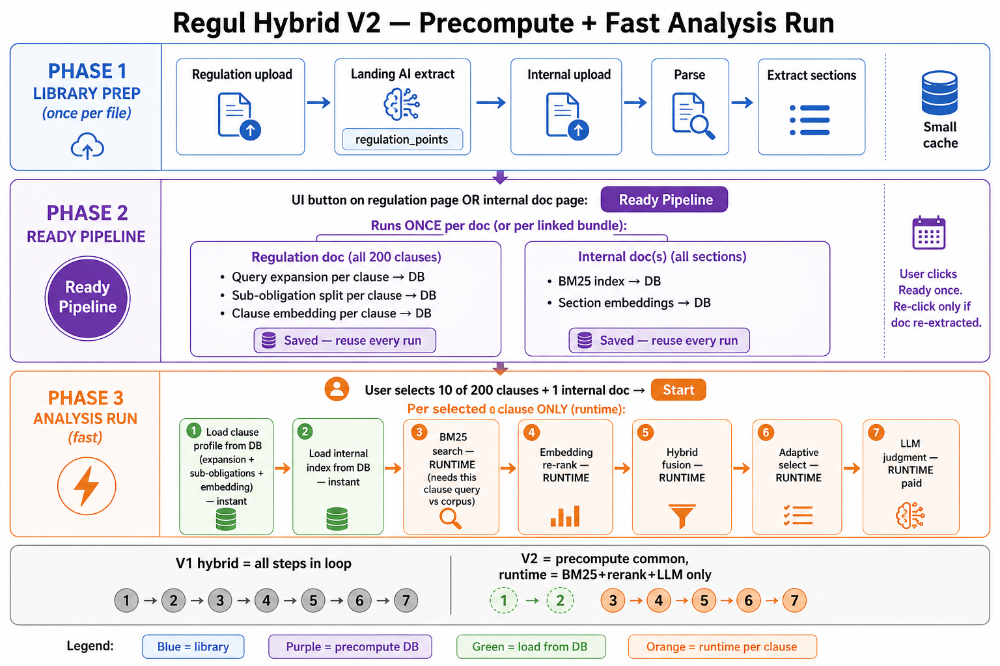

# Regul Hybrid V2 — Precompute then fast run

**Proposed improvement** over [V1 hybrid](regul-hybrid-pipeline-detail.md).

**Problem with V1:** every analysis run repeats the same work inside the clause loop (expansion, sub-obligation split, load/build indexes).

**V2 idea:** a **Ready Pipeline** button precomputes everything that depends only on the **regulation doc** or **internal doc**. Analysis runs only do the parts that need **this clause + these selected internal files**.



---

## Three phases

| Phase | When | Who triggers |
|-------|------|--------------|
| **1. Library prep** | Once per PDF upload | Parse + extract (today) |
| **2. Ready Pipeline** | Once per doc (re-run if doc changes) | **New button** on regulation / internal doc page |
| **3. Analysis run** | Each time user analyses | Select clauses + internal docs → Start |

---

## Phase 1 — Library prep (unchanged)

| Doc | Steps | Saved to |
|-----|-------|----------|
| Regulation | Upload → Landing AI extract | `regulation_points` (all clauses, e.g. 200) |
| Internal | Upload → Parse → Extract sections | `nd_internal_document_sections` |

No retrieval indexes yet.

---

## Phase 2 — Ready Pipeline (NEW)

### UI

Button on:

- **Regulation document page** — “Ready pipeline” (for all clauses in this reg doc)
- **Internal document page** — “Ready pipeline” (for all sections in this manual)

Status badge: `not_ready` → `ready` → `stale` (if doc re-extracted).

### What runs here (save to DB)

#### Regulation side — **all clauses** in that doc (e.g. 200)

| Step | Depends on | Saved as (proposed) |
|------|------------|---------------------|
| Query expansion | Clause text only | `regul_clause_search_profile.expanded_terms` |
| Sub-obligation split | Clause text only | `regul_clause_search_profile.sub_obligations` |
| Clause embedding | Clause text only | `regul_clause_search_profile.embedding` |

**Example — §8.4 precomputed once:**

```
expanded_terms: ["independent audit", "internal audit", "AML audit", …]
sub_obligations: ["audit frequency", "audit scope", "subsidiaries"]
embedding: [0.12, -0.04, …]   ← vector stored
```

Does **not** need internal doc. Same for all 200 clauses.

#### Internal side — **all sections** in that manual

| Step | Depends on | Saved as (proposed) |
|------|------------|---------------------|
| BM25 index | All section texts | `regul_internal_retrieval_index.bm25_index` |
| Section embeddings | Each section text | `regul_internal_section_embeddings` |

Does **not** need regulation doc. Built once per internal file.

### Cost

- Regulation ready: ~200 clause embeddings ≈ **$0.01** (one-time)
- Internal ready: ~150 section embeddings + BM25 ≈ **$0.02** (one-time)
- Re-analysis later: **$0** if status = `ready`

---

## Phase 3 — Analysis run (fast)

User picks e.g. **10 of 200 clauses** + **1 internal manual** → Start.

### Load from DB (instant)

| Load | From |
|------|------|
| 10 clause profiles | `regul_clause_search_profile` (only selected clause IDs) |
| 1 internal index | `regul_internal_retrieval_index` (only selected internal doc IDs) |

### Still runtime — **per selected clause**

These **must** run at analysis time because they combine **this clause’s query** with **this run’s internal corpus**:

| Step | Why runtime |
|------|-------------|
| **BM25 search** | Query = this clause’s expanded terms → score **all** sections in selected index → top ~100 |
| **Embedding retrieve** | Clause vector vs **all** section vectors (parallel, not after BM25) → top ~100 |
| **Hybrid fusion** | Union both lists + merge scores for this clause |
| **Adaptive select** | Pick 15–56 sections for **this** clause |
| **LLM judgment** | Paid — always per clause per run |

**BM25 is fast at runtime** if the index is already in DB (milliseconds). The heavy work was building the index at Ready Pipeline.

---

## V1 vs V2 — what moves where

| Step | V1 (every run, every clause) | V2 |
|------|------------------------------|-----|
| Query expansion | Loop | **Ready Pipeline** → DB |
| Sub-obligation split | Loop | **Ready Pipeline** → DB |
| Clause embedding | Loop | **Ready Pipeline** → DB |
| BM25 index build | Run start | **Ready Pipeline** → DB |
| Section embeddings | Run start | **Ready Pipeline** → DB |
| BM25 search + embedding retrieve | Loop | **Runtime** (parallel paths, load index + query) |
| Re-rank + fusion + select | Loop | **Runtime** |
| LLM judgment | Loop | **Runtime** |

---

## Example — 200-clause reg, 150-section manual

### One-time (Ready Pipeline)

```
Regulation doc CBUAE:
  → expand + split + embed × 200 clauses → DB

Internal AML Manual:
  → BM25 index + embed × 150 sections → DB
```

### Analysis run A — 80 clauses, 1 manual

```
Load 80 profiles + 1 index from DB     ← fast
BM25 + embedding (parallel) + LLM × 80 clauses     ← only this part in loop
```

### Analysis run B — 10 different clauses, same manual

```
Load 10 profiles + same index from DB  ← manual index reused, $0 rebuild
BM25 + embedding (parallel) + LLM × 10             ← cheap small run
```

### Analysis run C — same 10 clauses, **different** internal doc

```
Load same 10 profiles                ← reg side reused
Load different internal index        ← other manual’s Ready Pipeline
BM25 + embedding (parallel) + LLM × 10
```

---

## What each data source is used for

| Data | Ready Pipeline | Analysis run |
|------|----------------|--------------|
| Selected **gov clause text** | All clauses in reg doc | Only checked clauses |
| **Internal extract sections** | All sections in manual | Only sections from selected internal doc(s) |
| Full markdown | **Not used** | **Not used** |
| Unselected clauses | Precomputed but not loaded | Ignored |
| Unselected internal docs | Index exists in DB | Not loaded for this run |

---

## When to re-run Ready Pipeline

| Event | Action |
|-------|--------|
| Regulation re-extracted | Re-ready **regulation** doc |
| Internal sections re-extracted | Re-ready **internal** doc |
| Synonym table updated (admin) | Re-ready **regulation** docs (or version bump) |
| First time using hybrid on a doc | Click Ready Pipeline once |

---

## Proposed DB tables (sketch)

```
regul_clause_search_profile
  regulation_document_id, regulation_point_id
  expanded_terms jsonb
  sub_obligations jsonb
  embedding vector
  ready_at, version

regul_internal_retrieval_index
  internal_document_id
  bm25_index jsonb          -- or external index ref
  section_count, ready_at, version

regul_internal_section_embeddings
  internal_document_id, section_id
  embedding vector
```

---

## Summary

| Question | Answer |
|----------|--------|
| Precompute expansion for all 200 clauses? | **Yes** — at Ready Pipeline on reg doc |
| Precompute internal manual? | **Yes** — BM25 + section embeddings at Ready Pipeline |
| BM25 at runtime? | **Yes** — must match **this clause’s query** to **selected** internal index |
| Faster repeat runs? | **Yes** — load profiles + index from DB, skip rebuild |
| LLM every time? | **Yes** — judgment is always per run |

---

*V1 step guide: [`regul-hybrid-pipeline-detail.md`](regul-hybrid-pipeline-detail.md) · Overview: [`REGUL-HYBRID-RETRIEVAL-WORKFLOW.md`](REGUL-HYBRID-RETRIEVAL-WORKFLOW.md)*
