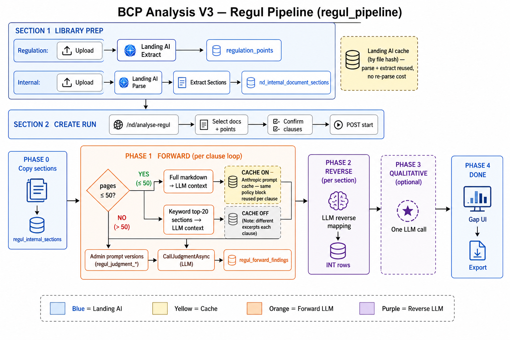
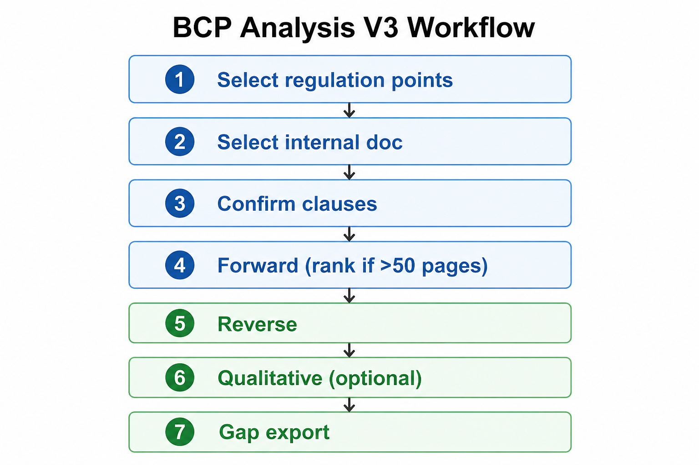
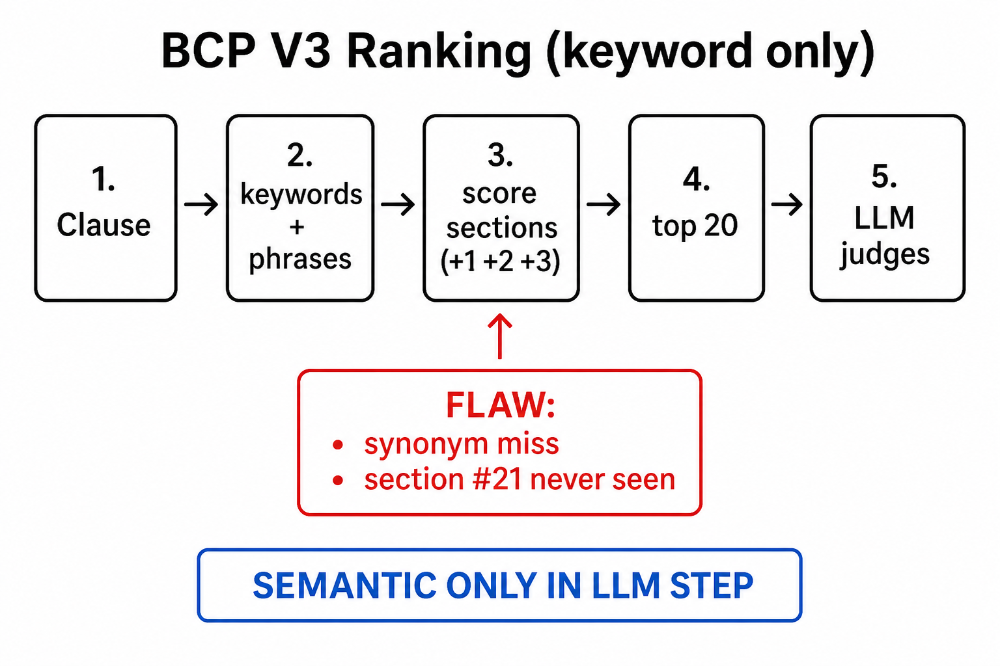

# BCP Analysis V3 — Regul Workflow

**Route:** `/nd/analyse-regul`  
**Engine:** `regul_pipeline`  
**Label:** V3 — Regul Workflow

Regul.ai-style compliance analysis ported into BCP: forward judgment → reverse coverage → optional qualitative.  
Uses **Landing AI** for document parse/extract; uses **admin-selected LLM** for judgment.

---

## Pipeline diagram (detailed)

## Overview (legacy)

---

## Stack

| Layer | Technology |
|-------|------------|
| Frontend | Angular (`bcp-web`) |
| Backend | ASP.NET Core (`bcp-api`) |
| Database | Supabase Postgres |
| Document parse/extract | Landing AI |
| Analysis LLM | Admin-selected (Google / OpenAI / Anthropic / xAI) |

---

## Prep (before analysis)

### Regulatory document
1. Upload to **Regulation documents** library
2. **Run extraction** (Landing AI) → points stored in `regulation_points`
3. Select points for the run (replaces Regul.ai Claude clause extract)

**UI:** `bcp-web/src/app/pages/nd/regulation-documents/`  
**API:** `POST /nd/regulation-documents/{id}/extract`

### Internal policy document
1. Upload to **Internal documents** library
2. **Run parse** (Landing AI) → markdown in `landing_ai_parse_cache`
3. **Extract sections** (optional but recommended) → `nd_internal_document_sections`

**UI:** `bcp-web/src/app/pages/nd/internal-documents/`  
**API:** `POST /nd/internal-documents/{id}/parse`, `POST …/extract-sections`

### Caching (prep + forward)

| Layer | When it applies | What is cached |
|-------|-----------------|----------------|
| **Landing AI parse** | Re-upload same file hash | `landing_ai_parse_cache` — skip re-parse |
| **Landing AI extract** | Re-extract same file hash | Extract points/sections — skip re-extract |
| **LLM context (Anthropic)** | Internal doc **≤ 50 pages** (full manual) | Same policy context block reused across all clauses |
| **LLM context** | Internal doc **> 50 pages** (top-20 ranking) | **Off** — different excerpt set per clause |

---

## Step-by-step workflow

### 1. Open Analysis V3
- **Analysis Versions** → **V3 — Regul Workflow** → `/nd/analyse-regul`

### 2. Select documents & points
- Pick regulation document + internal policy
- Check regulation points (clauses) to analyse

### 3. Confirm clauses (human gate — required)
- Review clause list in UI
- Click **Confirm clauses**
- Run button disabled until confirmed

**API:** `POST /nd/analysis-runs/{id}/confirm-clauses`

### 4. Create & start run
- Type `start` in confirm dialog
- Optional: enable **Qualitative assessment**
- Creates run with `workflow_engine = regul_pipeline`

**API:** `POST /nd/analysis-runs` → `POST …/start`  
**Processor:** `NdRegulAnalysisProcessor.ProcessRunAsync()`

### 5. Pipeline phases

| Order | Phase | What happens |
|-------|-------|--------------|
| 1 | Prep | Copy/extract internal sections → `regul_internal_sections` |
| 2 | **Forward** | LLM judges each regulatory clause vs internal policy |
| 3 | **Reverse** | LLM maps each internal section → regulatory clauses |
| 4 | **Qualitative** | One LLM call (if enabled) |
| 5 | Done | Gap UI, export PDF/Excel, maker → checker → reviewer |

---

## Forward phase (per regulatory clause)

### Policy context decision

| Internal doc size | What is sent to LLM |
|-------------------|---------------------|
| **≤ 50 pages** | **Full** parsed markdown — no ranking |
| **> 50 pages** | **Keyword ranking** → top **20** sections |

**Code:** `NdRegulPolicyContextService.cs` — `FullManualMaxPages = 50`, `RetrievalTopChunks = 20`

### Per clause
1. Build policy context (full or ranked excerpts)
2. LLM judgment call (`CallJudgmentAsync`)
3. Post-process: verify quotes, retry gap description
4. Save to `regul_forward_findings` + sync `analysis_points`

**Prompts:** Admin → Analysis prompts (`regul_judgment_*` keys)  
**Default source:** `NdRegulPromptDefaults.cs` (semantic matching v3/v4)

---

## Reverse phase (per internal section)

1. Load sections from `regul_internal_sections`
2. Build list of **selected** regulatory clauses only
3. One LLM call per section → map to clause numbers
4. Unmapped sections create **INT** gap rows

**Code:** `RunReversePhaseAsync()` in `NdRegulAnalysisProcessor.cs`

---

## Qualitative phase (optional)

- One LLM call with full regulation + policy text
- Stored in `regul_qualitative_assessments`
- Only runs when `enable_qualitative = true` on create

---

## Ranking system (keyword — not semantic)

When internal policy is **> 50 pages**, only the top **20** keyword-scored sections are sent to the LLM per clause.

| Step | What happens |
|------|----------------|
| 1 | Extract keywords (words ≥ 4 chars) + 2–4 word phrases from clause |
| 2 | Each internal section = one chunk |
| 3 | Score: +1 keyword in text, +2 in section ref, +3 for phrase match |
| 4 | Sort descending → take **top 20** |
| 5 | LLM judges semantically on those excerpts only |

**Important:** Ranking is **keyword only**. Semantic matching happens **after** ranking, inside the LLM call.

### Known flaws

| Flaw | Example |
|------|---------|
| Synonym miss | "independent audit" won't rank "Internal Audit Rule 9.4.1" |
| Top-K cutoff | Section ranked #21+ never seen by LLM |
| Different terminology | Regulator vs bank wording |
| Thin excerpts | Wrong sections → false non_compliant |

**Safer option:** Use docs ≤ 50 pages (full manual) or switch to **V4** (always full markdown).

**Code:** `bcp-api/Services/NewDashboard/NdRegulPolicyContextService.cs`

---

## Key file paths (BCP repo)

| Purpose | Path |
|---------|------|
| This workflow doc | `docs/discussion/workflow-v3.md` |
| Workflow diagram (detailed) | `docs/discussion/bcp-v3-pipeline-detail.png` |
| Workflow overview (legacy) | `docs/discussion/bcp-v3-workflow.png` |
| Ranking diagram | `docs/discussion/bcp-v3-ranking.png` |
| UI page | `bcp-web/src/app/pages/analyse-regul/analyse-regul.component.ts` |
| Pipeline processor | `bcp-api/Services/NewDashboard/NdRegulAnalysisProcessor.cs` |
| Policy context / ranking | `bcp-api/Services/NewDashboard/NdRegulPolicyContextService.cs` |
| Prompts | `bcp-api/Services/NewDashboard/NdRegulPromptDefaults.cs` |
| LLM service | `bcp-api/Services/Llm/RegulWorkflowLlmService.cs` |
| API controller | `bcp-api/Controllers/NewDashboard/AnalysisRunsController.cs` |
| Workflow engine constant | `bcp-api/Services/NewDashboard/AnalysisWorkflowEngine.cs` |
| DB schema | `bcp-api/scripts/supabase/009_regul_workflow.sql` |
| Code map (detailed) | `docs/workflow/REGUL-AI-WORKFLOW-CODE.md` |
| Ranking fix plan | `docs/workflow/REGUL-FORWARD-MATCHING-FIX-PLAN.md` |
| Hybrid retrieval (proposed) | [`REGUL-HYBRID-RETRIEVAL-WORKFLOW.md`](REGUL-HYBRID-RETRIEVAL-WORKFLOW.md) |

---

## V3 vs V8 (BCP Landing)

| | V3 Regul | V8 Landing |
|--|----------|------------|
| Engine | `regul_pipeline` | `bcp_landing` |
| Compare | Admin LLM judgment | Landing AI compare |
| Second model | No | Dual verify |
| Reverse coverage | Yes | No |
| Qualitative | Optional | No |
