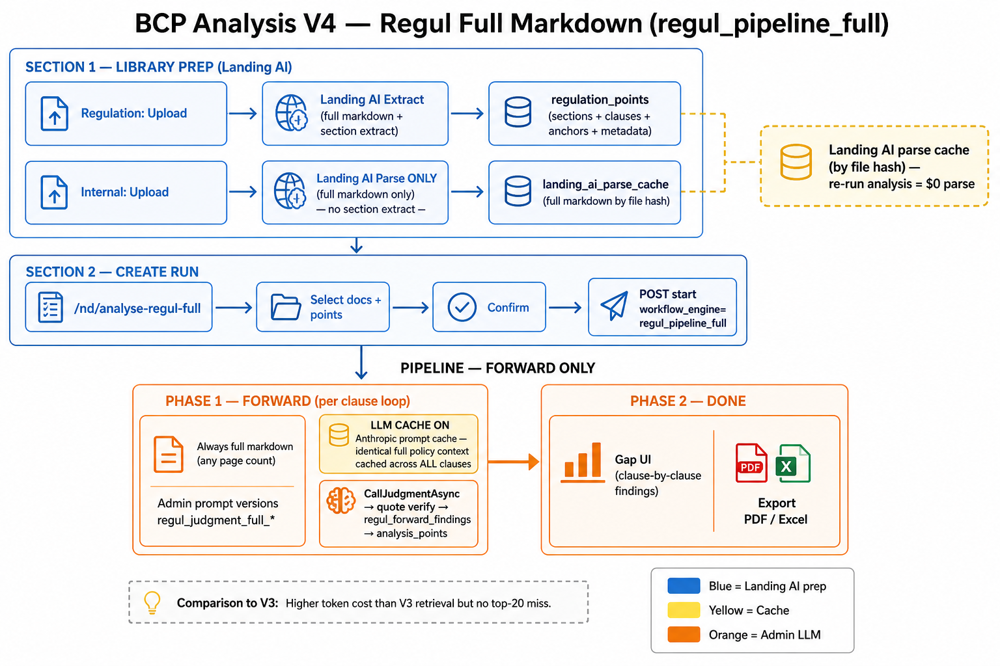
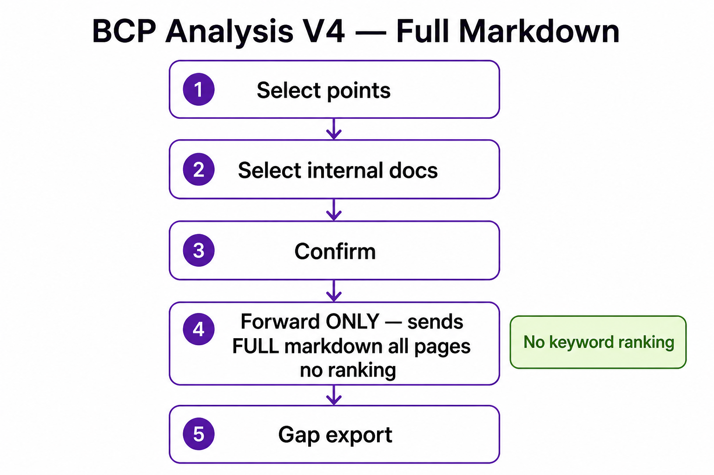

# BCP Analysis V4 — Regul Full Markdown

**Route:** `/nd/analyse-regul-full`  
**Engine:** `regul_pipeline_full`  
**Label:** V4 — Regul Full Markdown

Forward-only Regul workflow: sends **complete parsed markdown** for every attached internal file on every clause.  
**No keyword ranking. No reverse phase. No qualitative phase.**

---

## Pipeline diagram (detailed)



## Overview (legacy)



---

## Why V4 exists

V3 uses keyword ranking when internal docs exceed 50 pages, which can miss relevant sections (synonym mismatch, top-K cutoff).  
V4 trades higher token cost for accuracy by always sending the full internal policy text to the LLM.

---

## Stack

Same as V3 except:

| Difference | V4 |
|------------|-----|
| Workflow engine | `regul_pipeline_full` |
| Policy context | Always full markdown — **any page count**, multiple files |
| Phases | **Forward only** |
| Ranking | **None** |
| Reverse coverage | **Skipped** |
| Qualitative | **Skipped** |
| Prompts | Separate admin keys: `regul_judgment_full_*` (abbreviation & equivalence aware v2) |

---

## Prep (same as V3)

### Regulatory document
- Upload + extract points via Landing AI
- Select regulation points for the run

### Internal policy document
- Upload + **parse** (Landing AI) — sections extract **not required** for V4 forward
- V4 loads full markdown from `landing_ai_parse_cache` per file

### Caching

| Layer | What is cached |
|-------|----------------|
| **Landing AI parse** | `landing_ai_parse_cache` by file hash — re-run analysis = $0 parse |
| **LLM context (Anthropic)** | **Always on** — identical full-policy context block cached across every clause |

No section extract cache needed for forward (V4 uses full markdown, not `nd_internal_document_sections`).

---

## Step-by-step workflow

### 1. Open Analysis V4
- **Analysis Versions** → **V4 — Regul Full Markdown** → `/nd/analyse-regul-full`

### 2. Select documents & points
- Pick regulation document(s) + internal policy file(s)
- Select regulation points

### 3. Confirm & start
- Confirm clauses (required)
- Type `start`
- Dialog notes: *"Sends complete parsed markdown… no section ranking. Forward judgment only."*

**API:** `POST /nd/analysis-runs` with `workflowEngine: "regul_pipeline_full"`

### 4. Pipeline (forward only)

| Order | Phase | What happens |
|-------|-------|--------------|
| 1 | Prep | Load full markdown for all attached internal files |
| 2 | **Forward** | LLM judges each clause against **entire** policy text |
| 3 | Done | Gap UI + export |

No reverse. No qualitative. Processor exits after forward completes.

**Code:** `NdRegulAnalysisProcessor.cs` — when `IsRegulPipelineFull`, skips reverse/qualitative:

```csharp
if (AnalysisWorkflowEngine.IsRegulPipelineFull(run.WorkflowEngine))
{
    run.RegulPipelinePhase = "done";
    run.Status = "completed";
    // forward only, no reverse
    return;
}
```

---

## Forward phase (per regulatory clause)

### Policy context — always full

| Setting | V4 behavior |
|---------|-------------|
| Page limit | **None** — all pages sent |
| Multiple files | **Yes** — each file prefixed `=== DOCUMENT: filename ===` |
| Ranking | **Disabled** — `RegulPolicyContextMode.FullMarkdown` |
| Chunks | Not used for context selection |

**Code:** `NdRegulPolicyContextService.ResolveMode()` → `FullMarkdown`  
**Prompts:** `NdRegulPromptDefaults.JudgmentFullMarkdownSystemPromptV2` (admin key `regul_judgment_full_system`)

### Per clause
1. Build full markdown context for all internal files
2. LLM judgment with semantic + abbreviation/equivalence rules
3. Quote verification + gap sync to `analysis_points`

---

## No ranking in V4

V4 does **not** use `RankPolicyChunks()`.  
Every clause sees the complete internal policy — semantic judgment only.

| | V3 | V4 |
|--|----|----|
| Docs > 50 pages | Top 20 keyword sections | Full markdown |
| Token cost | Lower | Higher |
| Miss risk from ranking | Yes | No |
| Reverse pass | Yes | No |

---

## Trade-offs

| Pros | Cons |
|------|------|
| No synonym/top-K miss from ranking | Higher LLM token cost |
| Better for large manuals | No reverse coverage (INT gaps from internal-only sections not found) |
| Multiple internal files supported | No qualitative assessment on this page |
| Abbreviation-aware prompts (v2) | Rate limits may bite on very large docs |

---

## Key file paths (BCP repo)

| Purpose | Path |
|---------|------|
| This workflow doc | `docs/discussion/workflow-v4.md` |
| Workflow diagram (detailed) | `docs/discussion/bcp-v4-pipeline-detail.png` |
| Workflow overview (legacy) | `docs/discussion/bcp-v4-workflow.png` |
| UI page | `bcp-web/src/app/pages/analyse-regul-full/analyse-regul-full.component.ts` |
| Base UI (shared template) | `bcp-web/src/app/pages/analyse-regul/analyse-regul.component.ts` |
| Pipeline processor | `bcp-api/Services/NewDashboard/NdRegulAnalysisProcessor.cs` |
| Full markdown context | `bcp-api/Services/NewDashboard/NdRegulPolicyContextService.cs` |
| Full markdown prompts | `bcp-api/Services/NewDashboard/NdRegulPromptDefaults.cs` |
| Prompt version seeding | `bcp-api/Services/NewDashboard/NdAnalysisPromptVersionService.cs` |
| Workflow engine | `bcp-api/Services/NewDashboard/AnalysisWorkflowEngine.cs` |
| Engine constant (frontend) | `bcp-web/src/lib/nd/regul-fields.ts` → `REGUL_PIPELINE_FULL` |
| V3 workflow (for comparison) | [`workflow-v3.md`](workflow-v3.md) |
| Hybrid retrieval (proposed) | [`REGUL-HYBRID-RETRIEVAL-WORKFLOW.md`](REGUL-HYBRID-RETRIEVAL-WORKFLOW.md) |

---

## When to use V3 vs V4

| Use **V3** when | Use **V4** when |
|-----------------|-----------------|
| You want reverse coverage + qualitative | Ranking misses sections on large manuals |
| Internal doc ≤ 50 pages (full manual anyway) | You need forward-only, highest recall |
| Token cost matters | Accuracy on large docs matters more than cost |
