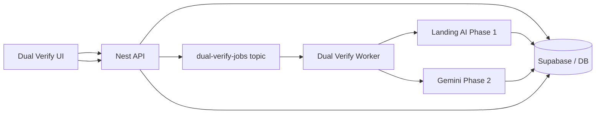

# Kafka Dual Verify — Beginner Setup Guide

**For:** First-time Kafka users on BCP  
**Goal:** Run dual verify (Landing AI + Gemini) in the background using a queue

> **Full professional guide (Azure setup, NestJS + .NET, retries, DLQ):**  
> [KAFKA_AZURE_DUAL_VERIFY_FULL_GUIDE.md](./KAFKA_AZURE_DUAL_VERIFY_FULL_GUIDE.md)

---

## 1. What is Kafka? (30 seconds)

Think of Kafka as a **mailbox for jobs**:

```text
Producer (API)  →  puts job in mailbox (topic)
Consumer (Worker)  →  reads job and does the work
```

You do **not** wait in the browser while 50 points analyze.  
The API drops jobs in Kafka and returns immediately. Workers finish them one by one (or in parallel).

---

## 2. What you need before starting

| Item | Why |
|------|-----|
| Azure account | Event Hubs = Azure’s Kafka-compatible service |
| BCP API running (`apps/api`) | Producer + worker live here |
| `GEMINI_API_KEY` in `.env` | Phase 2 |
| `VISION_AGENT_API_KEY` (optional) | Phase 1 Landing AI |
| Supabase / DB | Store session + results (already in BCP) |

**You do NOT need to install Kafka on your laptop for production.**  
Use **Azure Event Hubs**. For local dev you can use Docker Kafka (optional, step 8).

---

## 3. Big picture — dual verify pipeline

### Today (no Kafka)

```text
Browser → API → compare-point (Landing AI) → bcpanalyze (Gemini) → save
         (UI waits / loops in browser)
```

### With Kafka

```text
Browser
  → POST /dual-verify/jobs
  → API creates session in DB
  → API publishes 1 Kafka message PER gov point
  → API returns sessionId immediately

Worker (Nest consumer)
  → reads 1 message
  → Phase 1: POST logic → LandingAiService.comparePoint()
  → Phase 2: POST logic → BcpAnalyzeService.analyze()
  → agreement check
  → save to DB
  → (optional) publish to dual-verify-results topic

Browser
  → polls GET /dual-verify/jobs/:sessionId every 2–3 sec
  → shows progress: 12/50 done
```

---

## 4. Azure setup (step by step)

### Step 4.1 — Create Event Hubs namespace

1. Go to [Azure Portal](https://portal.azure.com)
2. **Create a resource** → search **Event Hubs**
3. Create **namespace** (not only a single hub)
   - Name: e.g. `bcp-kafka-dev`
   - Pricing: **Standard** (Basic does not support Kafka endpoint)
   - Region: closest to your API
4. Wait until deployment finishes

### Step 4.2 — Enable Kafka

1. Open your namespace → **Settings** → **Kafka**
2. Turn **Kafka** **On** (if shown)
3. Note the **Kafka bootstrap server**:

```text
bcp-kafka-dev.servicebus.windows.net:9093
```

### Step 4.3 — Create topics (Event Hubs)

In Event Hubs, each “topic” is an **Event Hub** with a name.

Create **two**:

| Event Hub name | Purpose |
|----------------|---------|
| `dual-verify-jobs` | Work to do (one message = one gov point) |
| `dual-verify-results` | Optional: worker finished one point |

For each hub:
1. Namespace → **Event Hubs** → **+ Event Hub**
2. Name: exact names above
3. Partitions: **4** (dev) or **8** (prod)
4. Create

### Step 4.4 — Get connection string

1. Namespace → **Shared access policies**
2. Use **RootManageSharedAccessKey** (dev only) or create a policy with **Send** + **Listen**
3. Copy **Connection string** (starts with `Endpoint=sb://...`)

### Step 4.5 — Add to BCP `.env`

```env
# Kafka / Azure Event Hubs
KAFKA_ENABLED=true
KAFKA_BROKERS=bcp-kafka-dev.servicebus.windows.net:9093
KAFKA_SASL_USERNAME=$ConnectionString
KAFKA_SASL_PASSWORD=Endpoint=sb://bcp-kafka-dev.servicebus.windows.net/;SharedAccessKeyName=RootManageSharedAccessKey;SharedAccessKey=YOUR_KEY
KAFKA_CLIENT_ID=bcp-api
KAFKA_CONSUMER_GROUP=dual-verify-workers
KAFKA_TOPIC_JOBS=dual-verify-jobs
KAFKA_TOPIC_RESULTS=dual-verify-results
```

> **Never commit** the real connection string. Keep it in `.env` only.

---

## 5. NestJS setup (step by step)

### Step 5.1 — Install packages

From repo root:

```bash
npm install kafkajs --workspace=apps/api
```

Optional (if you want Nest microservice transport later):

```bash
npm install @nestjs/microservices --workspace=apps/api
```

**Recommended for beginners:** use `kafkajs` inside a normal Nest service (simpler than microservices).

### Step 5.2 — Folder structure (add to `apps/api`)

```text
apps/api/src/modules/kafka/
  kafka.module.ts
  kafka-producer.service.ts
  dual-verify-consumer.service.ts
  dual-verify-job.types.ts

apps/api/src/modules/dual-verify/
  dual-verify.module.ts
  dual-verify.controller.ts
  dual-verify.service.ts
  dual-verify-worker.service.ts   # calls Landing AI + Gemini
```

### Step 5.3 — Message shape (one per gov point)

```typescript
// dual-verify-job.types.ts
export interface DualVerifyJobMessage {
  jobId: string;
  sessionId: string;
  pointId: string;
  pointTitle: string;
  govText: string;
  internalDocId: string;      // e.g. imptfs — worker loads from Supabase
  govDocId: string;           // e.g. gov-tfs-guidelines
  granularity: 'section' | 'leaf';
  model: string;              // e.g. gemini-2.5-flash-lite
  createdAt: string;
}
```

**Do not put PDF bytes in the message.**

### Step 5.4 — Producer (API publishes jobs)

When user clicks **Run Dual Verify** with 20 points:

1. Create `sessionId` in DB (`status: queued`)
2. Loop 20 points → `producer.send({ topic: 'dual-verify-jobs', messages: [...] })`
3. Return `{ sessionId, totalPoints: 20 }`

### Step 5.5 — Consumer (worker runs pipeline)

On app start (or separate `npm run worker:dual-verify` process):

1. `consumer.connect()`
2. `consumer.subscribe({ topic: 'dual-verify-jobs' })`
3. For each message:
   - Parse JSON
   - Set point status `running` in DB
   - **Phase 1:** reuse `LandingAiService` compare (same as `/landing-ai/compare-point`)
   - **Phase 2:** reuse `BcpAnalyzeService` (same as `/ai/bcpanalyze`)
   - Compare Phase 1 vs Phase 2 → `aligned` | `mismatch` | `confidence_gap`
   - Save row to `compliance_sessions` (same table BCP already uses)
   - Set point status `completed`
   - Commit Kafka offset (mark message done)

If Phase 1 or 2 fails → retry 3 times → then mark `failed` in DB.

### Step 5.6 — New API endpoints

| Method | Path | What it does |
|--------|------|--------------|
| `POST` | `/dual-verify/jobs` | Create session + publish Kafka messages |
| `GET` | `/dual-verify/jobs/:sessionId` | Progress: `completedCount / totalCount` |
| `GET` | `/dual-verify/jobs/:sessionId/results` | Full point results |

### Step 5.7 — Wire UI (later)

Change `dual-verify-workbench.tsx`:

- Instead of looping `compare-point` + `bcpanalyze` in the browser
- Call `POST /dual-verify/jobs` once
- Poll `GET /dual-verify/jobs/:sessionId` until `status === completed`
- Load results from `GET .../results`

Existing endpoints stay for manual/debug use.

---

## 6. One message or all at once?

| Approach | Use when |
|----------|----------|
| **One Kafka message per gov point** | ✅ Production — parallel, retry per point, progress bar |
| One message with all point IDs | Small tests only |
| One message with full PDFs | ❌ Never — too big, slow, hard to retry |

**Rule:** 50 gov points = **50 small Kafka messages**, same `sessionId`, same doc IDs.

---

## 7. Order of implementation (do in this order)

### Phase A — Azure only (no code)

- [ ] Create Event Hubs namespace (Standard)
- [ ] Create hubs: `dual-verify-jobs`, `dual-verify-results`
- [ ] Copy connection string to `.env`

### Phase B — Kafka smoke test

- [ ] Install `kafkajs` in `apps/api`
- [ ] Small script: send `"hello"` to `dual-verify-jobs`, read it back
- [ ] Confirm Azure connection works

### Phase C — Producer in Nest

- [ ] `KafkaProducerService`
- [ ] `POST /dual-verify/jobs` publishes test messages

### Phase D — Worker

- [ ] `DualVerifyWorkerService` consumes messages
- [ ] Call existing Landing AI + Gemini services
- [ ] Save to DB

### Phase D — Progress API

- [ ] `GET /dual-verify/jobs/:sessionId` returns counts

### Phase E — UI

- [ ] Dual verify workbench uses new endpoints

---

## 8. Local dev without Azure (optional)

Run Kafka in Docker for learning:

```bash
docker run -d --name kafka -p 9092:9092 \
  -e KAFKA_CFG_NODE_ID=0 \
  -e KAFKA_CFG_PROCESS_ROLES=controller,broker \
  -e KAFKA_CFG_LISTENERS=PLAINTEXT://:9092,CONTROLLER://:9093 \
  -e KAFKA_CFG_ADVERTISED_LISTENERS=PLAINTEXT://localhost:9092 \
  -e KAFKA_CFG_CONTROLLER_QUORUM_VOTERS=0@localhost:9093 \
  -e KAFKA_CFG_CONTROLLER_LISTENER_NAMES=CONTROLLER \
  bitnami/kafka:latest
```

Local `.env`:

```env
KAFKA_BROKERS=localhost:9092
# no SASL for local plain Kafka
```

Use Azure for staging/production; Docker is fine for learning.

---

## 9. How worker maps to existing BCP code

| Pipeline step | Existing code / endpoint |
|---------------|--------------------------|
| Load gov points | `GET /landing-ai/stored-points` or extract |
| Load IMPTFS markdown | Supabase parse cache |
| Phase 1 compare | `LandingAiService` → `/landing-ai/compare-point` |
| Phase 2 verify | `BcpAnalyzeService` → `/ai/bcpanalyze` |
| Save session | `POST /landing-ai/compliance-sessions` |
| UI today | `dual-verify-workbench.tsx` |

Worker = **same logic**, moved from browser loop → background consumer.

---

## 10. Testing checklist

1. **Producer test:** `POST /dual-verify/jobs` with 1 point → message appears in Azure (use Kafka tool or logs)
2. **Consumer test:** worker logs “Processing point 2.1”
3. **Phase 1 test:** result saved with `landingMessage`
4. **Phase 2 test:** result saved with `llmMessage`
5. **Progress test:** `GET /jobs/:id` shows `1/1 completed`
6. **Failure test:** bad point ID → retries → `failed` in DB, other points still run
7. **UI test:** workbench shows results without browser hanging

---

## 11. Common mistakes (avoid these)

| Mistake | Fix |
|---------|-----|
| Putting PDF in Kafka message | Store doc in Supabase; send only `internalDocId` |
| One giant message for 50 points | One message per point |
| UI still calls compare in a loop | UI only starts job + polls |
| No consumer group | Set `KAFKA_CONSUMER_GROUP=dual-verify-workers` |
| Basic tier Event Hubs | Use **Standard** for Kafka |
| Same consumer runs 100 parallel Gemini calls | Limit concurrency (e.g. 3–5 at a time) |

---

## 12. Simple diagram



---

## 13. Next step in this repo

Kafka is **designed but not coded yet**. After Azure is ready, the first code task is:

1. Add `KafkaProducerService` + smoke test
2. Add `DualVerifyWorkerService` that processes **one** point end-to-end
3. Add `POST /dual-verify/jobs` with **one** point
4. Scale to many points + UI polling

See also:

- [KAFKA_DUAL_VERIFY_SIMPLE.md](./KAFKA_DUAL_VERIFY_SIMPLE.md) — short design
- [DUAL_VERIFY_AND_ANALYSIS_WORKFLOW.md](./DUAL_VERIFY_AND_ANALYSIS_WORKFLOW.md) — Phase 1 + Phase 2 details
- [BCP_PIPELINE_SIMPLE.md](./BCP_PIPELINE_SIMPLE.md) — prompts and models
