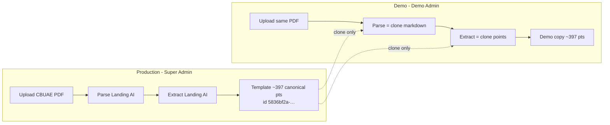
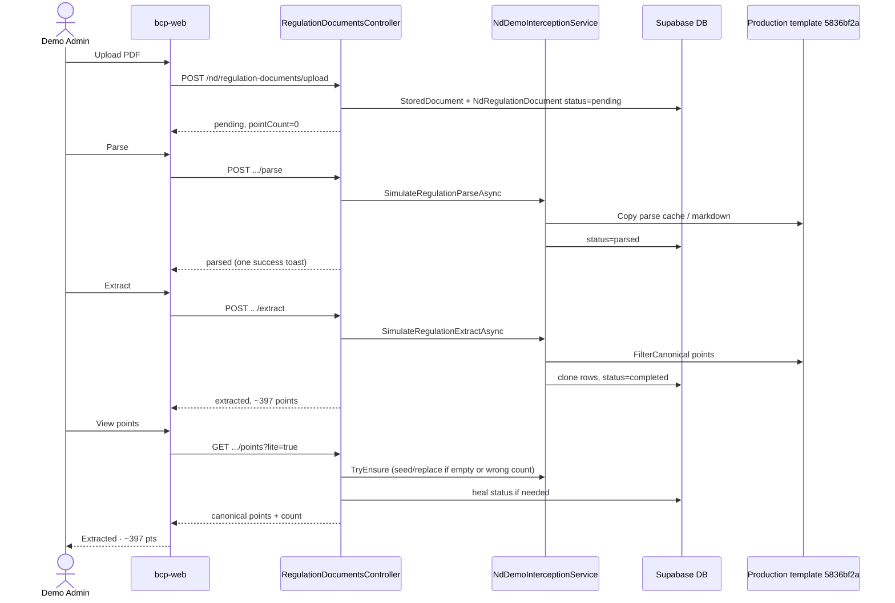

# Demo regulation flow: Upload → Parse → Extract → View

This document explains how **Demo Admin** (and other demo-isolated users) handle regulation documents in the New Dashboard. Demo never calls Landing AI for CBUAE/TFS regulation parse/extract. It **clones** from a production template that a Super Admin already extracted.

---

## Big picture

| Role | What happens on Parse / Extract |
|------|----------------------------------|
| **Demo user** | Simulated progress UI + **clone** parse cache / points from production template |
| **Super Admin / production maker** | Real Landing AI parse + extract |



**Configured template (CBUAE):** `5836bf2a-e1f9-4a65-8ae0-8fee71f7cef6`  
(`NdDemoIsolation:DemoRegulationTemplateDocumentId` in `appsettings.json`)

---

## Status values (what the UI shows)

| DB / API status | Typical UI label | Meaning |
|-----------------|------------------|---------|
| `pending` | Pending parse | File saved; not parsed yet |
| `processing` | Parsing… / Extracting… | Job in progress |
| `parsed` | Pending extract | Markdown ready; points not cloned/extracted yet |
| `completed` / display `extracted` | Extracted | Canonical points exist |
| `failed` | Failed | Last step failed |
| `paused` | Paused | User stopped extract |

**Display rule:** if `pointCount > 0`, list/detail usually show **Extracted** (even if raw status was briefly wrong). View also **heals** `parsed`/`pending` → `completed` when points already exist.

**Canonical count:** junk/glossary duplicates are filtered via `NdRegulationPointCanonicalFilter` (same rules as Repair). Expected CBUAE band: **~397 ± 25**.

---

## End-to-end demo happy path



---

## Step 1 — Upload

**UI:** Regulation Docs Library → Upload regulation  
**API:** `POST /nd/regulation-documents/upload`

### What happens
1. Auth: `super_admin` or `maker` (demo maker included).
2. File stored in Supabase Storage.
3. Rows created:
   - `StoredDocuments` (file metadata, hash, path)
   - `NdRegulationDocuments` with `ExtractionStatus = pending`, `CreatedBy = demo user`
4. **No AI, no clone** on upload (kept fast so the browser does not time out at 60s).

### Result
- Status: **Pending parse**
- Points: `—`

### Code
- `RegulationDocumentsController.Upload`
- `NdRegulationUploadService.UploadAndExtractAsync` (name is historical; upload only)

---

## Step 2 — Parse (demo)

**UI:** Parse / Re-parse  
**API:** `POST /nd/regulation-documents/{id}/parse`

### Who is “demo simulated”?
`NdDemoInterceptionService.CanMutateRegulationDocument`:
- Demo isolation enabled
- Doc is **not** the production template id
- Doc `CreatedBy` is a demo profile
- Viewer is in demo AI-simulation mode

### What demo parse does (`SimulateRegulationParseAsync`)
1. Sets `processing` + short progress labels (Reading document… / Building markdown… / Saving…).
2. Finds production parse source (prefer configured template’s stored file).
3. **Copies Landing AI parse cache** (markdown) from production → demo stored doc.
4. Sets demo doc `ExtractionStatus = parsed`.
5. **Does not** write regulation points yet.

### If no production parse source
Parse still completes as `parsed` (demo can continue to Extract, which clones points from the template).

### UI behavior
- Polls doc status while `processing`
- One “Parse complete” toast
- Row shows **Pending extract**

### Production contrast
Non-demo parse calls Landing AI (`NdRegulationUploadService.ParseByRegulationIdAsync`) and spends credits.

---

## Step 3 — Extract (demo)

**UI:** Extract / Run extraction  
**API:** `POST /nd/regulation-documents/{id}/extract`

### Demo branch (high level)
1. If status is `pending` / `failed` / empty → **auto-parse first**, then extract.
2. Set `processing` (“Copying regulation points…”).
3. Soft-remove any existing active points on this demo doc.
4. **Clone canonical points** from the CBUAE template only:
   - Resolve template by `NdRegulationDocuments.Id` **or** `StoredDocumentId` = `DemoRegulationTemplateDocumentId`
   - `FilterCanonical` on source active points
   - Insert new `NdRegulationPoints` for the demo doc
5. Set `ExtractionStatus = completed`, `ExtractedAt`, `ExtractedBy`.
6. Return `pointCount` = canonical count (~397).

### Rules (important)
- CBUAE demo clone uses **only** the configured template — not name/hash “best match” (those caused ~541/493 junk clones).
- Expected band for validation/replace: **397 ± 25**.
- If template missing or has 0 canonical points → **400** with a clear error (Super Admin must extract the real CBUAE template first).

### Production contrast
Non-demo extract queues live Landing AI extract (`ExtractByRegulationIdAsync`) and may return `202` while processing.

---

## Step 4 — View points

**UI:** View / open side panel  
**API:** `GET /nd/regulation-documents/{id}/points?lite=true`

### What happens (in order)
1. Resolve doc by regulation id or stored-document id.
2. Optional §5 patch for CBUAE (`EnsureCbuaeSection5LandingAiPatchAsync`) if section 5 is missing.
3. **Status heal:** if canonical points &gt; 0 but status is still `parsed`/`pending` → set `completed`.
4. **Demo ensure** (`TryEnsureRegulationPointsSeededAsync`) when doc is **demo-owned**:
   - If empty → clone from template
   - If CBUAE count **outside** ~397±25 → **replace** with a fresh template clone
   - If count already good → leave as-is
5. Return active points, optionally `lite` (truncated text for faster UI).
6. Response `pointCount` is **canonical** (after `FilterCanonical`).

### UI behavior
- Panel builds chapter tree; **only first chapter expanded** by default (avoids freeze on ~400 rows).
- Summary line: `N stored · M compared in gap analysis · … introduction…`
- List row should show **Extracted** and **N pts** after load (panel syncs `pointCount` + status).

### `demoScope=true` (analysis only)
Used from analysis screens to optionally narrow clauses to the **94 demo judgment clauses**. Library “View points” normally uses `lite=true` **without** forcing that 94-clause filter — library shows the full ~397 clone.

---

## Data model (minimal)

```
StoredDocument          NdRegulationDocument           NdRegulationPoint
─────────────────       ──────────────────────         ─────────────────
Id, FileHash            Id, StoredDocumentId           RegulationDocumentId
StoragePath             Name, CreatedBy                PointNumber, Title, Content
ParseStatus             ExtractionStatus               PageReference, Status
ExtractionCacheKey      ExtractionMarkdown             (Active / Removed)
                        ExtractedAt / ExtractedBy
```

Demo isolation: list APIs hide production-owned docs from demo viewers and vice versa. **Clone reads** the production template by configured id (cross-isolation read for seeding only).

---

## Key files

| Area | File |
|------|------|
| HTTP API | `bcp-api/Controllers/NewDashboard/RegulationDocumentsController.cs` |
| Demo clone / simulate | `bcp-api/Services/NewDashboard/Demo/NdDemoInterceptionService.cs` |
| Who can mutate | `bcp-api/Services/NewDashboard/Demo/NdDemoDataFilters.cs` |
| Template ids | `bcp-api/Services/NewDashboard/Demo/NdDemoIsolationOptions.cs`, `appsettings.json` |
| Canonical counts | `bcp-api/Services/NewDashboard/NdRegulationPointCanonicalFilter.cs` |
| UI library page | `bcp-web/.../nd-regulation-documents.component.ts` |
| Points panel | `bcp-web/.../nd-regulation-points-panel.component.ts` |

---

## Diagnostic endpoint

```http
GET /nd/admin/demo/regulation-clone-source
```

Returns whether the configured template resolves (by regulation id or stored-document id), raw vs canonical point counts, and `cloneReady`.

---

## Failure modes (quick)

| Symptom | Likely cause | What to do |
|---------|--------------|------------|
| Upload times out (~60s) | Clone was wrongly on upload (fixed) | Keep upload = store only |
| Extract 400 “no template to clone” | Template missing or 0 points in this DB | Super Admin: open real CBUAE → View points / Repair / Extract |
| Toast ~541 then Pending extract / 0 pts | Old bloated clone + wipe race (fixed) | Delete demo row; re-upload; Parse → Extract; or View points to auto-replace |
| Pending extract but points visible | Status not healed / list count 0 | Refresh View points (heal + sync) |
| 493 stored in panel | Bloated rows before template-only clone | Demo View points replaces; or delete + re-extract |
| Laggy points panel | Expanding all ~400 details | Default = first chapter only |

---

## Checklist for a clean demo demo

1. **Super Admin** once per environment:
   - Production CBUAE (`5836bf2a-…` or the configured id) is extracted
   - View points shows **~397** canonical points and §5 is present
2. **Demo Admin**:
   - Upload CBUAE PDF → **Pending parse**
   - **Parse** → **Pending extract** (one toast)
   - **Extract** → **Extracted · ~397 pts** (one toast, no blink)
   - **View** → same ~397, status Extracted, panel responsive

---

## Analysis note (94 vs 397)

- **Regulation library / extract:** demo copies **~397** regulation points (full CBUAE surface for browsing).
- **Demo gap analysis judgments:** use the **94** seeded clauses (`cbuae-aml-demo-judgments.json` / `demo-cbuae-seed-clauses.ts`). That filter is for analysis runs (`demoScope`), not for replacing the library extract.
