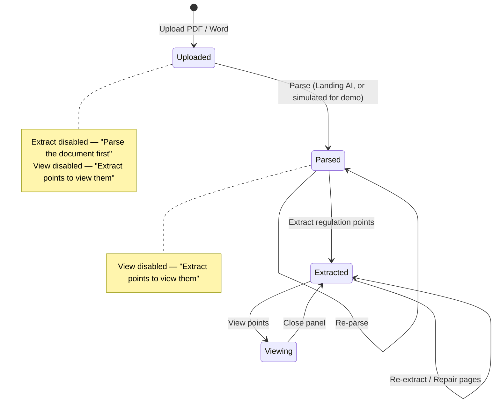
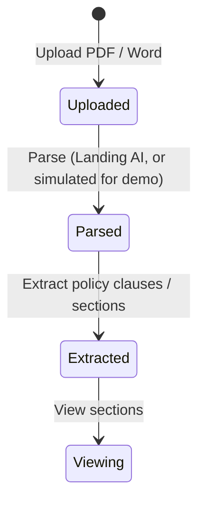
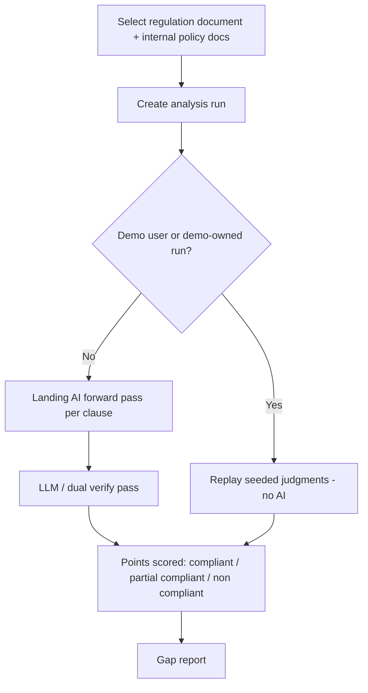
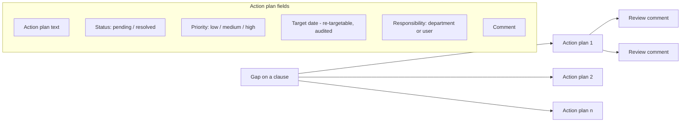
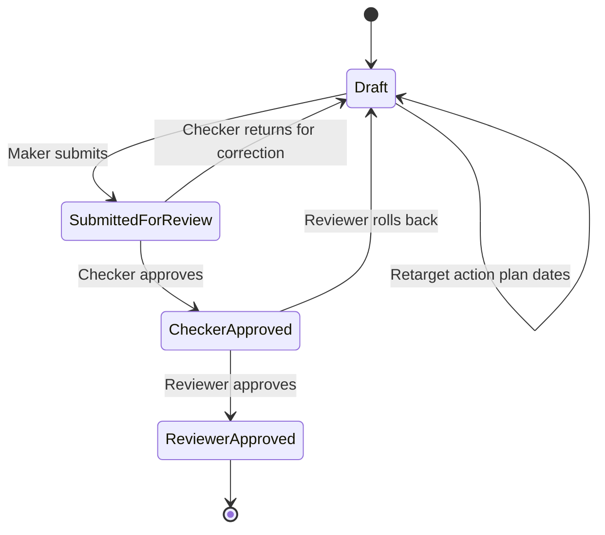
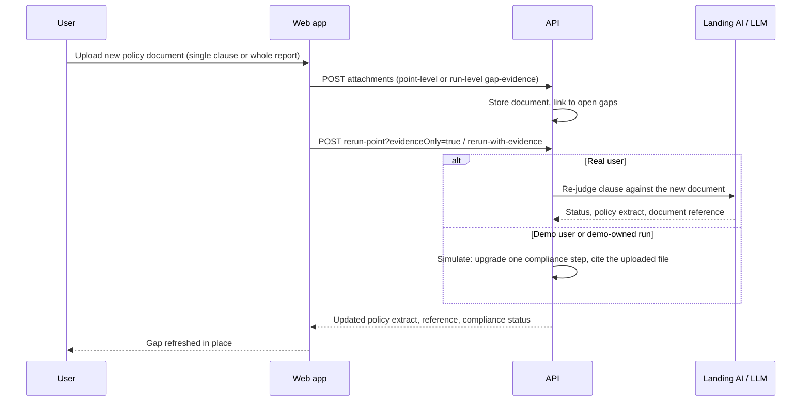
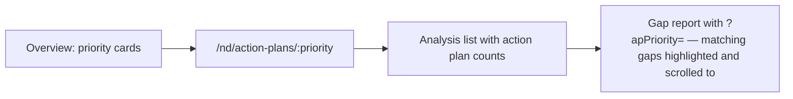
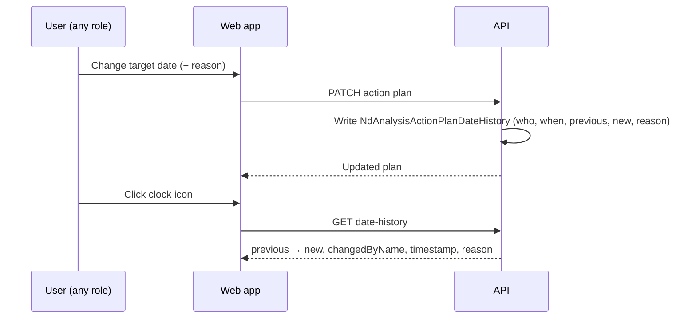

# System workflow diagrams

End-to-end picture of the compliance workflow: document intake, analysis, action plans,
maker/checker/reviewer approval, and the demo variant that never calls AI.

## 1. Document intake — upload → parse → extract → view

Every regulation document moves through fixed states. Buttons for a later stage stay disabled,
with a tooltip naming the missing step, until the earlier stage completes.

Available at every state, independent of processing: **Open**, **Download source**, **Delete**.

Internal policy documents use the same gated sequence.

## 2. Analysis run lifecycle

## 3. Gap → action plans → review → approval

All four roles (`super_admin`, `maker`, `checker`, `reviewer`) can add and edit action plans and
change target dates. Every target-date change is recorded with who changed it and when, and is
readable from the clock icon on the plan. Review comments can be added by `super_admin`,
`checker` and `reviewer`, and are listed in the right-hand panel.

## 4. Approval workflow

## 5. Re-checking gaps against a newly issued policy document

## 6. Priority rollup navigation

## 7. Retarget an action-plan date

Anyone who can edit an action plan can change its target date. The change is audited; the clock
icon on the plan opens the history.

## 8. Real vs demo behaviour

| Stage | Real user | Demo user |
| --- | --- | --- |
| Parse | Landing AI | Simulated, staged progress |
| Extract | Landing AI clause extraction | Cloned from the demo admin template clause list |
| Regulation points shown | Whatever was extracted | Exactly the clauses configured in `nd/admin/demo` |
| Analysis | Landing AI + LLM | Seeded judgments replayed |
| Gap re-check with new evidence | Live re-judgement | Simulated one-step improvement citing the uploaded file |
| Action plans, reviews, exports | Live data | Demo-scoped data, same UI |

Demo regulation point counts stay consistent everywhere — regulation document list, points panel,
analysis runs and exports all read the same admin-managed clause set, and editing the template in
`nd/admin/demo` re-syncs existing demo documents and runs.
